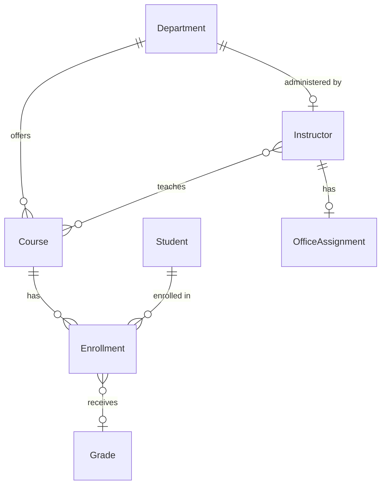

# Everything GitHub Copilot — Hands-On Lab

A comprehensive, hands-on lab teaching the **full GitHub Copilot agentic development experience** — agents, skills, instructions, prompts, hooks, MCP servers, orchestration, and GitHub Agentic Workflows — all while working on a real .NET application.

> ⏱️ **Pre-work** — complete setup before the session begins.

---

## Prerequisites

### Must-Have Now

| Requirement | Details |
|------------|---------|
| **GitHub account** | With Copilot license (Individual, Business, or Enterprise) |
| **VS Code** | Latest version with [GitHub Copilot](https://marketplace.visualstudio.com/items?itemName=GitHub.copilot) extension |
| **Git** | [Install](https://git-scm.com/downloads) — configured with your GitHub credentials |

### Additional Tools by Path or Lab

| Applies to | Requirement |
|------------|------------|
| All labs | **GitHub CLI** (`gh`) — [Install](https://cli.github.com/) — verify with `gh --version` |
| All labs | **Copilot CLI** — [Install guide](https://docs.github.com/en/copilot/how-tos/copilot-cli/set-up-copilot-cli/install-copilot-cli): `npm install -g @github/copilot` — verify with `copilot --version` |
| Manual Setup only | **.NET 8 SDK** — [Download](https://dotnet.microsoft.com/download/dotnet/8.0) — verify with `dotnet --version` — **devcontainer users: already included in the container** |
| Labs 08–09 | **gh-aw extension** — `gh extension install github/gh-aw` — verify with `gh aw version` |
| Labs 08–09 | **Node.js** (v18+) — [Download](https://nodejs.org/) — verify with `node --version` |

### Permissions & Licensing

Most labs (01–07, 10) work with **any Copilot license**. A few labs require specific plans or permissions:

| Lab | Feature | Required License | GitHub Permissions |
|-----|---------|-----------------|-------------------|
| **Lab 08** | GitHub Agentic Workflows (`gh-aw`) | Copilot Business or Enterprise | Actions enabled, `COPILOT_GITHUB_TOKEN` secret ([setup](labs/lab08.md#84-configure-the-copilot_github_token-secret)) |
| **Lab 09** | Copilot Coding Agent + Code Review | Copilot Pro+, Business, or Enterprise | Repo admin (to configure rulesets + enable coding agent) |
| All other labs | Agents, Skills, Instructions, Prompts, Hooks, MCP, Orchestration | Any Copilot license (Individual+) | Repo write access |

> **Note:** If your organization restricts Copilot features via policy, check with your admin that agent mode, MCP servers, and Copilot CLI are enabled.

---

## Choose Your Path

| Path | Time | For | Recommendation |
|------|------|-----|----------------|
| [**Codespaces**](#option-a--github-codespaces) | 5–10 min | In-person workshops, no local install | ⭐ **Start here** |
| [**Docker Desktop**](#option-b--vs-code--docker-desktop) | ~15 min | Already using Docker | ✅ Popular |
| [**Podman**](#option-c--vs-code--podman) | ~15 min | Enterprise (Docker restricted) | ✅ Supported |
| [**Manual**](#option-d--manual-setup) | ~20 min | Prefer direct install | Advanced |

---

### Option A — GitHub Codespaces

**5–10 min | Zero local install**

1. Fork this repository (see [Fork & Clone](#fork--clone) below)
2. On your fork: click **Code** → **Codespaces** → **Create codespace on main**
3. Wait for the codespace to build (first time takes a few minutes — the post-create script installs all tools and builds the solution)
4. Once the terminal is ready, authenticate:
   ```shell
   copilot login
   gh auth login
   ```
5. ➜ **[Jump to Verify Copilot CLI](#verify-copilot-cli)**

> **Tip:** If _"Codespaces"_ does not appear under the **Code** button, your organization may not have Codespaces enabled. Ask your admin, or use Option B or C below.

---

### Option B — VS Code + Docker Desktop

**~15 min | Has Docker**

1. Install the [Dev Containers](https://marketplace.visualstudio.com/items?itemName=ms-vscode-remote.remote-containers) VS Code extension
2. Ensure [Docker Desktop](https://www.docker.com/products/docker-desktop/) is running
3. Fork and clone this repository (see [Fork & Clone](#fork--clone) below)
4. Open the repo folder in VS Code
5. When prompted _"Reopen in Container"_, click **Yes** — or run **Dev Containers: Reopen in Container** from the Command Palette (`Ctrl+Shift+P` / `Cmd+Shift+P`)
6. Wait for the container to build (first time takes a few minutes)
7. Once the terminal is ready, authenticate:
   ```shell
   copilot login
   gh auth login
   ```
8. ➜ **[Jump to Verify Copilot CLI](#verify-copilot-cli)**

The container includes: .NET 8 + 9 SDKs, Node.js, GitHub CLI, Copilot CLI, gh-aw, jq, and all recommended VS Code extensions.

---

### Option C — VS Code + Podman

**~15 min | Enterprise/Docker restricted**

1. Install [Podman](https://podman.io/docs/installation) and the [Dev Containers](https://marketplace.visualstudio.com/items?itemName=ms-vscode-remote.remote-containers) VS Code extension
2. Configure VS Code to use Podman as the container engine. Open **Settings** (`Ctrl+,` / `Cmd+,`) and set:
   ```json
   "dev.containers.dockerPath": "podman"
   ```
3. Start the Podman machine (if not already running):

   **macOS / Windows:**
   ```shell
   podman machine init
   podman machine start
   ```

   **Linux:** Podman runs natively — no machine needed. Ensure the Podman socket is active:
   ```bash
   systemctl --user enable --now podman.socket
   ```
4. Fork and clone this repository (see [Fork & Clone](#fork--clone) below)
5. Open the repo folder in VS Code
6. Run **Dev Containers: Reopen in Container** from the Command Palette (`Ctrl+Shift+P` / `Cmd+Shift+P`)
7. Wait for the container to build (first time takes a few minutes)
8. Once the terminal is ready, authenticate:
   ```shell
   copilot login
   gh auth login
   ```
9. ➜ **[Jump to Verify Copilot CLI](#verify-copilot-cli)**

> **Podman troubleshooting:** If the container fails to start, verify the Podman socket path matches what VS Code expects. On Linux, set `"dev.containers.dockerSocketPath": "/run/user/1000/podman/podman.sock"` (adjust the UID if yours differs). On macOS/Windows, `podman machine start` handles this automatically.

---

### Option D — Manual Setup

**~20 min | Prefer direct install**

Before starting, ensure you have all [prerequisites](#prerequisites) installed.

1. Fork and clone this repository (see [Fork & Clone](#fork--clone) below)
2. Build the solution:
   ```shell
   dotnet build ContosoUniversity.sln
   ```
3. _(Optional)_ Run the application:
   ```shell
   dotnet run --project ContosoUniversity.Web
   ```
   The app starts at **https://localhost:52379** (or http://localhost:52380). Press `Ctrl+C` to stop.
4. Open in VS Code:
   ```shell
   code .
   ```
5. ➜ **[Jump to Verify Copilot CLI](#verify-copilot-cli)**

<details>
<summary><strong>🐧 Linux — platform-specific install notes</strong></summary>

- **.NET 8 SDK**: Follow the [Install .NET on Linux](https://learn.microsoft.com/dotnet/core/install/linux) guide for your distribution.
- **GitHub CLI**: Install via package manager — see [Installing gh on Linux](https://github.com/cli/cli/blob/trunk/docs/install_linux.md).
- **Node.js**: Install via your package manager or [NodeSource](https://github.com/nodesource/distributions), or use [nvm](https://github.com/nvm-sh/nvm).
- **VS Code**: Download from [code.visualstudio.com](https://code.visualstudio.com/), or install via Snap: `sudo snap install code --classic`.

</details>

<details>
<summary><strong>🍎 macOS — platform-specific install notes</strong></summary>

- **.NET 8 SDK**: Download from [dotnet.microsoft.com](https://dotnet.microsoft.com/download/dotnet/8.0) or: `brew install dotnet-sdk`.
- **GitHub CLI**: `brew install gh`.
- **Node.js**: `brew install node`, or use [nvm](https://github.com/nvm-sh/nvm).
- **VS Code**: Download from [code.visualstudio.com](https://code.visualstudio.com/) or: `brew install --cask visual-studio-code`.

</details>

<details>
<summary><strong>🪟 Windows — platform-specific install notes</strong></summary>

- **.NET 8 SDK**: Download from [dotnet.microsoft.com](https://dotnet.microsoft.com/download/dotnet/8.0) or: `winget install Microsoft.DotNet.SDK.8`.
- **GitHub CLI**: `winget install GitHub.cli` or the [MSI installer](https://cli.github.com/).
- **Node.js**: Download from [nodejs.org](https://nodejs.org/) or: `winget install OpenJS.NodeJS.LTS`.
- **VS Code**: Download from [code.visualstudio.com](https://code.visualstudio.com/) or: `winget install Microsoft.VisualStudioCode`.

</details>

---

## Fork & Clone

> **GitHub EMU users:** If your organization uses [GitHub Enterprise Managed Users (EMU)](https://docs.github.com/en/enterprise-cloud@latest/admin/identity-and-access-management/understanding-iam-for-enterprises/about-enterprise-managed-users) and **cannot fork** external repositories, skip to [Clone into Your Own Namespace](#clone-into-your-own-namespace-github-emu-users) below.

🌐 **On GitHub:**

1. Fork this repository: click **Fork** at the top of this page
2. Go to your fork's **Settings** → **Actions** → **General** and ensure Actions are enabled
3. Go to the **Actions** tab and click _"I understand my workflows, go ahead and enable them"_ if prompted

🖥️ **On your machine:**

4. Clone your fork:

**WSL/Bash:**
```bash
git clone https://github.com/YOUR-USERNAME/day-in-the-life-copilot-lab.git
cd day-in-the-life-copilot-lab
```

**PowerShell:**
```powershell
git clone https://github.com/YOUR-USERNAME/day-in-the-life-copilot-lab.git
Set-Location day-in-the-life-copilot-lab
```

5. Verify the .NET project builds:

```shell
dotnet build ContosoUniversity.sln
```

You should see:
```
Build succeeded.
    0 Warning(s)
    0 Error(s)
```

6. _(Optional)_ Run the application:

```shell
dotnet run --project ContosoUniversity.Web
```

The app starts at **https://localhost:52379** (or http://localhost:52380). On first run, the database is automatically created and seeded with sample data.

> **Note:** The Development configuration uses SQLite, which works on all platforms (Windows, macOS, Linux). The database file (`ContosoUniversity.db`) is created automatically. Production uses SQL Server.

Press `Ctrl+C` to stop.

---

### Clone into Your Own Namespace (GitHub EMU Users)

> **Who is this for?** If your organization uses [GitHub Enterprise Managed Users (EMU)](https://docs.github.com/en/enterprise-cloud@latest/admin/identity-and-access-management/understanding-iam-for-enterprises/about-enterprise-managed-users), you **cannot fork** repositories that live outside your enterprise. Follow these steps to create a copy in your own GitHub namespace.

🌐 **On GitHub:**

1. Navigate to [github.com/new](https://github.com/new) to create a new repository
2. Set the **Owner** to your EMU account (e.g., `YOUR-USERNAME_ENTERPRISE`)
3. Name the repository `day-in-the-life-copilot-lab`
4. Set visibility to **Private** (or Internal, per your organization's policy)
5. **Do not** initialize the repository with a README, `.gitignore`, or license
6. Click **Create repository**
7. After pushing the lab content (see steps below), go to **Settings** → **Actions** → **General** and ensure Actions are enabled

🖥️ **On your machine:**

1. Clone the source repository:

**WSL/Bash:**
```bash
git clone https://github.com/ms-mfg-community/day-in-the-life-copilot-lab.git
cd day-in-the-life-copilot-lab
```

**PowerShell:**
```powershell
git clone https://github.com/ms-mfg-community/day-in-the-life-copilot-lab.git
Set-Location day-in-the-life-copilot-lab
```

2. Change the remote `origin` to point to **your** new repository:

**WSL/Bash:**
```bash
git remote set-url origin https://github.com/YOUR-USERNAME_ENTERPRISE/day-in-the-life-copilot-lab.git
```

**PowerShell:**
```powershell
git remote set-url origin https://github.com/YOUR-USERNAME_ENTERPRISE/day-in-the-life-copilot-lab.git
```

3. Push all branches and tags to your new repository:

```shell
git push --all origin
git push --tags origin
```

4. Verify the .NET project builds:

```shell
dotnet build ContosoUniversity.sln
```

5. _(Optional)_ Run the application:

```shell
dotnet run --project ContosoUniversity.Web
```

> **Tip:** To keep your copy in sync with the source, add it as an `upstream` remote:
> ```shell
> git remote add upstream https://github.com/ms-mfg-community/day-in-the-life-copilot-lab.git
> git fetch upstream
> git merge upstream/main
> ```

Once complete, continue with [Verify Copilot CLI](#verify-copilot-cli) below.

---

## Verify Copilot CLI

🖥️ **On your machine:**

1. Verify Copilot CLI is installed:

```shell
copilot --version
```

2. Authenticate the Copilot CLI:

```shell
copilot login
```

> **Note:** The Copilot CLI has its own authentication — it does **not** use `gh auth`. Running `copilot login` opens a browser-based device code flow. Alternatively, set a `GH_TOKEN` environment variable with a fine-grained PAT that has the **Copilot Requests** permission.

3. Verify Copilot CLI is authenticated by sending a test prompt:

```shell
copilot -p "hello"
```

If authenticated, you'll receive a response. If not, the CLI will prompt you to log in.

4. Verify the Agentic Workflows CLI is installed:

```shell
gh aw version
```

> **Note:** The `gh aw` extension relies on `gh auth` for GitHub API access. Run `gh auth status` to verify your GitHub CLI authentication separately.

---

## Explore the Repository

🖥️ **On your machine:**

1. Open the repository in VS Code:

```shell
code .
```

2. Explore the key directories:

| Directory | Contents | Count |
|-----------|----------|-------|
| `.github/skills/` | Agent skills (`SKILL.md`) | 10 |
| `.github/prompts/` | Prompt templates (`.prompt.md`) | 21 |
| `.github/hooks/` | Hook configuration | 1 |
| `.github/instructions/` | Path-specific instructions (`.instructions.md`) | 3 |
| `.copilot/` | MCP server configuration | 1 |
| `scripts/hooks/` | Hook shell scripts | 17 |
| `ContosoUniversity.*` | .NET project files | 5 projects |

3. Read the repository context document:

**WSL/Bash:**
```bash
cat AGENTS.md
```

**PowerShell:**
```powershell
Get-Content AGENTS.md
```

4. _(Optional)_ Create a tracking issue in your fork:

🌐 **On GitHub** — create an issue with:
- Title: `Lab Progress — Everything GitHub Copilot`
- Body:
```markdown
### Lab Progress
- [x] Setup
- [ ] Lab 01: Exploring Copilot Configuration
- [ ] Lab 02: Custom Instructions & AGENTS.md
- [ ] Lab 03: Creating a .NET Agent
- [ ] Lab 04: Skills & Prompts
- [ ] Lab 05: MCP Server Configuration
- [ ] Lab 06: Hooks
- [ ] Lab 07: Multi-Agent Orchestration
- [ ] Lab 08: gh-aw: PRD Generation
- [ ] Lab 09: Copilot Coding Agent & Code Review
- [ ] Lab 10: Session Management & Memory
```

---

## ✅ Setup Complete

You now have:
- A forked repository with all Copilot configurations
- A building .NET project (ContosoUniversity) — optionally verified running at https://localhost:52379
- Copilot CLI authenticated and gh-aw CLI installed
- An understanding of the repository structure

**Next:** [Lab 01 — Exploring Copilot Configuration](labs/lab01.md)

---

## The Application

**ContosoUniversity** is a brownfield .NET 8 web application with clean architecture. You'll use it throughout every lab to build, test, and orchestrate AI-powered development workflows.

```
ASP.NET MVC (Web)  →  EF Core (Infrastructure)  →  SQL Server / SQLite
```



| Project | Layer | Purpose |
|---------|-------|---------|
| **ContosoUniversity.Core** | Domain | Models, interfaces, business rules |
| **ContosoUniversity.Infrastructure** | Data | EF Core, repositories, services |
| **ContosoUniversity.Web** | Presentation | MVC controllers, views, DI |
| **ContosoUniversity.Tests** | Testing | xUnit + WebApplicationFactory |
| **ContosoUniversity.PlaywrightTests** | E2E | Browser-based Playwright tests |

---

## What You'll Learn

| Feature | What It Does | Lab |
|---------|-------------|-----|
| **Plugin Marketplace** | Browse and install community agents from the CLI marketplace | 01 |
| **Agents** | Custom `.agent.md` profiles with specialized AI roles | 01, 03 |
| **Skills** | `SKILL.md` auto-activating knowledge packs | 01, 04 |
| **Instructions** | `copilot-instructions.md` + path-scoped `.instructions.md` | 02 |
| **AGENTS.md** | Repository-level context — always loaded | 02 |
| **Prompts** | `.prompt.md` reusable command templates | 04 |
| **MCP Servers** | External tool integrations (Context7, Memory, Microsoft Learn) | 05 |
| **Hooks** | Pre/post tool-use lifecycle automation | 06 |
| **Orchestration** | Multi-agent coordination workflows | 07 |
| **Agentic Workflows** | `gh-aw` CI/CD automation with AI agents | 08, 09 |
| **Coding Agent** | Platform-level issue → PR implementation | 09 |
| **Code Review** | AI-powered pull request reviews | 09 |
| **Reindex** | Automatic semantic understanding of your codebase | 10 |
| **Session Management** | Memory MCP for decisions, handoffs, continuous learning | 10 |

---

## Lab Modules

> 💡 **Multi-Platform Support:** All lab command lines provide both **PowerShell** and **WSL/Bash** alternatives. Choose the commands that work best for your environment.

| Lab | Module | Focus |
|-----|--------|-------|
| [Setup](#choose-your-path) | Fork, Prerequisites, Overview | Fork repo, enable Actions, install tools |
| [Lab 01](labs/lab01.md) | Exploring Copilot Configuration | Plugin marketplace, agents, skills, instructions, prompts |
| [Lab 02](labs/lab02.md) | Custom Instructions & AGENTS.md | Instruction hierarchy, modify, extend |
| [Lab 03](labs/lab03.md) | Creating a .NET Agent | Build `dotnet-dev.agent.md` |
| [Lab 04](labs/lab04.md) | Skills & Prompts | Create a skill, write a prompt template |
| [Lab 05](labs/lab05.md) | MCP Server Configuration | Configure Context7, Memory, Sequential Thinking |
| [Lab 06](labs/lab06.md) | Hooks | Pre/post tool hooks, build checks |
| [Lab 07](labs/lab07.md) | Multi-Agent Orchestration | Orchestrator → dev → QA → review |
| [Lab 08](labs/lab08.md) | gh-aw: PRD Generation | Branch creation triggers PM agent |
| [Lab 09](labs/lab09.md) | Copilot Coding Agent & Code Review | Issue → Coding Agent → PR → AI review |
| [Lab 10](labs/lab10.md) | Reindex, Session Management & Memory | Reindex, Memory MCP, continuous learning, handoffs |

**Total: ~3 hours** (10 labs — self-paced or presenter-led)

---

## Pre-Configured Copilot Features

This repo ships with a rich set of configurations for you to explore and extend:

| Category | Count | Examples |
|----------|-------|---------|
| **Agents** | 2 (+ more you build!) | `planner`, `code-reviewer` — learners create more in Labs 03, 07 |
| **Skills** | 10 | `coding-standards`, `tdd-workflow`, `security-review`, `verification-loop`, `frontend-patterns` |
| **Prompts** | 21 | `/plan`, `/commit`, `/code-review`, `/tdd`, `/create-test`, `/handoff`, `/create-agent` |
| **Hooks** | 7 | Secret scanning, code formatting, type checking, continuous learning, error logging |
| **MCP Servers** | 5 | Context7 (library docs), Memory (knowledge graph), Sequential Thinking, WorkIQ, Microsoft Learn |
| **Instructions** | 3 | Path-specific rules for `.cs`, test files, and more |

---

## Useful Commands

| Task | Command |
|------|---------|
| Build solution | `dotnet build ContosoUniversity.sln` |
| Run tests | `dotnet test ContosoUniversity.sln` |
| Run web app | `dotnet run --project ContosoUniversity.Web` |
| Run specific test | `dotnet test --filter "FullyQualifiedName~TestName"` |
| Check Copilot CLI | `copilot --version` |
| Install gh-aw | `gh extension install github/gh-aw` |

---

## Repository Structure

```
day-in-the-life-copilot-lab/
├── .github/
│   ├── agents/                    # 2 agent profiles — more created during labs
│   ├── skills/                    # 10 agent skills (SKILL.md)
│   ├── prompts/                   # 21 prompt templates (.prompt.md)
│   ├── hooks/                     # Hook configuration (default.json)
│   ├── instructions/              # 3 path-specific instructions (.instructions.md)
│   ├── copilot-instructions.md    # Repository-wide instructions
│   └── workflows/                 # GitHub Agentic Workflows (.md + .lock.yml)
├── .copilot/
│   └── mcp-config.json            # MCP server configuration (5 servers)
├── ContosoUniversity.sln          # .NET solution file
├── ContosoUniversity.Core/        # Domain models and interfaces
├── ContosoUniversity.Infrastructure/  # Data access and services
├── ContosoUniversity.Web/         # ASP.NET MVC web application
├── ContosoUniversity.Tests/       # xUnit unit and integration tests
├── ContosoUniversity.PlaywrightTests/ # Playwright E2E tests
├── labs/                          # Hands-on lab modules (10 labs)
├── solutions/                     # Reference solutions for each lab
├── docs/                          # Research and reference documentation
├── scripts/hooks/                 # Hook shell scripts (Bash + PowerShell)
├── mcp-configs/                   # MCP server reference configurations
├── AGENTS.md                      # Repository-level agent context
└── TROUBLESHOOTING.md             # Common issues and fixes
```

---

## GitHub Agentic Workflows

This lab uses [GitHub Agentic Workflows](https://github.com/github/gh-aw) (gh-aw) — author GitHub Actions using Markdown with YAML frontmatter. Two workflows are included:

| Workflow | Trigger | What It Does |
|----------|---------|-------------|
| **PRD Generation** | Feature branch created | PM agent generates a Product Requirements Document |
| **Code Review** | Pull request opened | Code review agent provides automated feedback |

---

## Workshop Content

| Resource | Description |
|----------|-------------|
| [Setup](#choose-your-path) | Fork, prerequisites, environment setup |
| [Lab Modules](labs/) | 10 hands-on labs — start here |
| [Reference Solutions](solutions/) | Completed solutions for each lab |
| [Troubleshooting](TROUBLESHOOTING.md) | Common issues and fixes |
| [AGENTS.md](AGENTS.md) | Full project context document |

---

## Troubleshooting

| Problem | Fix |
|---------|-----|
| Copilot CLI not authenticated | Run `gh auth login` and follow prompts |
| MCP servers not loading | Copy `.copilot/mcp-config.json` to `~/.copilot/`, restart VS Code |
| `dotnet build` fails | Verify .NET 8 SDK: `dotnet --version` — [download](https://dotnet.microsoft.com/download/dotnet/8.0) |
| Skills not activating | Reference the skill explicitly in your prompt, or check `SKILL.md` frontmatter |
| Copilot not responding | Verify the extension is signed in and enabled in VS Code |

For the full troubleshooting guide, see [TROUBLESHOOTING.md](TROUBLESHOOTING.md).

---

## Contributing

See [CONTRIBUTING.md](CONTRIBUTING.md) for guidelines on adding agents, skills, prompts, and other configurations.

## License

[MIT](LICENSE)

---

*Built with GitHub Copilot.*
